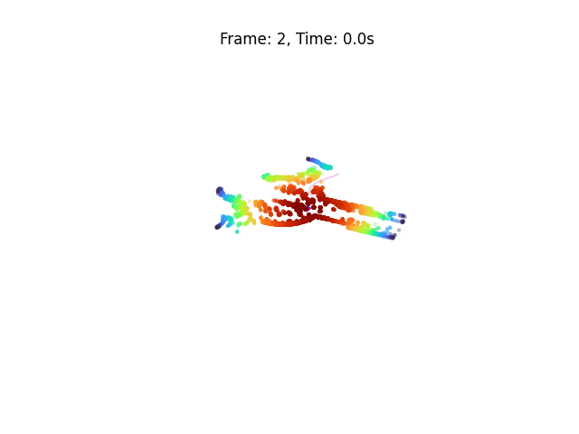

# afterKITTI

Convert the [KITTI dataset](https://www.cvlibs.net/datasets/kitti/) to python!

The perfect afterparty :tada: for python aficionados :snake: working with the KITTI dataset :blue_car:.

- Data as numpy arrays
- Visualization with matplotlib

<div align="center">
   
   
   
   <p><em>Sample 2011_09_26_drive_0005  from the KITTI dataset. <br>Top: Camera data from the sample. <br>Bottom: Associated point cloud (3D left and 2D right), car pose and trajectory in numpy/matplotlib</em></p>
</div>

<!-- 2011_09_26_drive_0005 -->

## Requirements

Create a new python environment with the associated requirements:

```
conda create --name kitti python=3.8.10
conda activate kitti
pip install -r requirements.txt
```

To ensure that Python paths are properly defined, update the `~/.bashrc` by adding the following lines

```
export AFTERKITTI_PATH=/path_to_afterKITTI
export PYTHONPATH=$PYTHONPATH:/$AFTERKITTI_PATH
```

A of the dataset ([2011_09_23_drive_0005](https://s3.eu-central-1.amazonaws.com/avg-kitti/raw_data/2011_09_26_drive_0005/2011_09_26_drive_0005_sync.zip)) has already been preprocessed for you, and is available in the [data/rosbags](data/rosbags) folder. You can load and visualize it with the following commands:

```bash
   python afterkitti/load_and_visualize.py
```

## Usage

You can convert any of the [raw data](https://www.cvlibs.net/datasets/kitti/raw_data.php) provided in KITTI by following this procedure:

1. **Convert raw data to ROS** by using [kitti2bag](https://github.com/tomas789/kitti2bag). When doing so, follow the instructions in [this issue](https://github.com/tomas789/kitti2bag/issues/54#issuecomment-1950313060) and move it to [data/rosbags](data/rosbags) folder.

   You can visualize the generated rosbags with the following commands (in separate terminals):

   ```bash
   rosbag play -l data/rosbags/kitti_2011_09_26_drive_0005_synced.bag

   rosrun rviz rviz -d rviz_view.rviz
   ```

2. **Convert ROS to Python** by running:

   ```bash
   python afterkitti/ros2python.py
   ```

   This will generate a `pickle` file in the [data/pickles](data/rosbags) folder.
